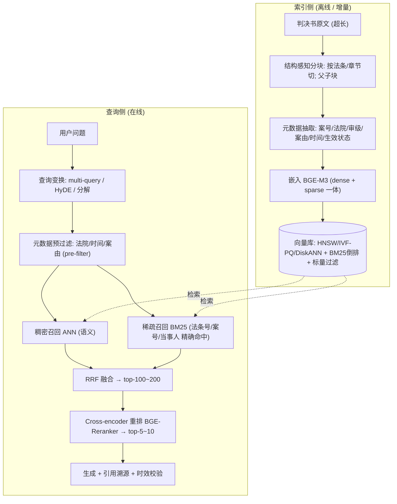
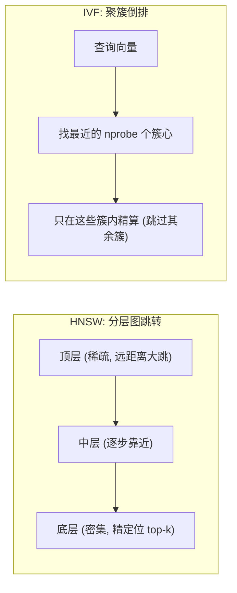
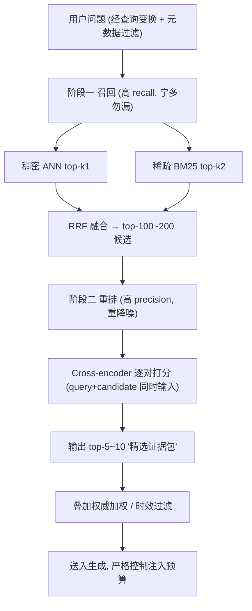
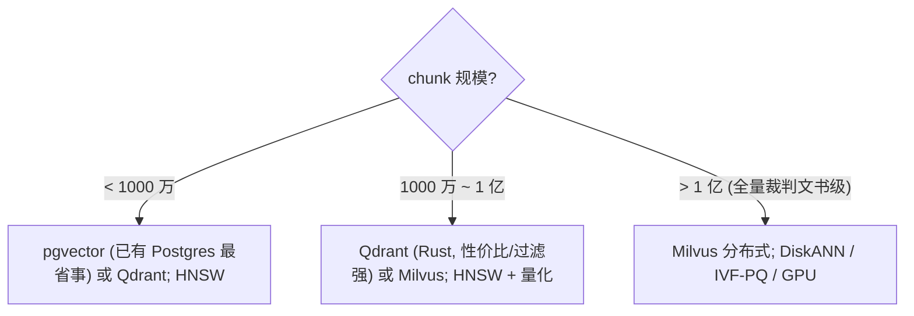

# 海量向量检索方案：以法院判例库为例

> 本文从「余弦相似度 brute-force 的局限」出发，系统梳理把语义检索放大到**海量、高精度、强可解释**场景（典型如法院判例库）的完整工程方案，配 mermaid 图。
>
> 姊妹篇：`docs/notes/openclaw-memory-system-zh.md`（OpenClaw 记忆系统是本文方案的「个人小规模版」）。
> 文中产品延迟/规模数字来自 2026 年公开基准与产品报告，会随版本演进，落地前请用自有数据复测。

---

## 一、核心认知：要换的不是「余弦」，是「全量算」和「只靠向量」

很多人把"检索慢/不准"归咎于余弦相似度本身，这是误解。要换的是两件事：

1. **别再「全量算」**：brute-force 余弦是 `O(N × d)`，N 是向量数、d 是维度。几万条没问题（OpenClaw 个人记忆就这么干），但判例库动辄千万到上亿 chunk，必须改用 **ANN 近似最近邻索引**把召回降到近似对数级。
2. **别再「只靠向量」**：法律检索里，法条号、案号、当事人是**精确字面**问题，纯语义向量会漏；还要按法院层级、时间、案由**过滤**，按权威**加权**，并且**可溯源、查时效**。所以必须上**混合检索 + 两阶段重排 + 领域工程**。

一句话：**余弦相似度（度量）继续用；变的是「怎么找候选」和「找完怎么排」。**

---

## 二、整体架构



三层视角：**索引层（解决"全量算"）→ 检索层（解决"只靠向量"）→ 领域层（解决"法律特化"）**，下面逐层展开。

---

## 三、第①层 索引层：用 ANN 替代 brute-force

### 3.1 brute-force 的边界

精确（FLAT）brute-force 的好处是召回 100%，坏处是线性扫描。经验阈值：单机 commodity 硬件、约 1024 维下，brute-force 在 **~25 万向量内**可保持 <100ms；再大就需要 ANN。判例库远超此线。

### 3.2 ANN 索引对比

| 索引 | 原理 | 优点 | 代价 | 适用规模 |
|------|------|------|------|---------|
| **FLAT** | 全量精确扫描 | 召回 100% | `O(N×d)`，慢 | 小规模 / 离线评测基准 |
| **HNSW** | 分层可导航小世界图，贪心跳转 | 低延迟、高召回 | 吃内存，构建较慢 | 默认首选，百万~亿级（内存够） |
| **IVF (+PQ)** | k-means 聚簇倒排 + 乘积量化压缩 | 省内存、可超大规模 | 召回略降，需调参 | 千万~亿级，内存吃紧 |
| **DiskANN** | Vamana 图，索引落 SSD | 超 RAM 容量仍低延迟 | 工程复杂 | 十亿级 |

### 3.3 索引原理（直观图）



- **HNSW**：上层稀疏负责"大步逼近"，下层密集负责"精定位"，搜索从顶层贪心下降，避免扫全量。
- **IVF**：先把空间用 k-means 切成 `nlist` 个簇，查询时只搜最近的 `nprobe` 个簇，其余直接跳过。

### 3.4 量化压缩（与 ANN 叠加）

- **SQ（标量量化）**：float32 → int8，省 4× 存储，召回损失小。
- **PQ（乘积量化）**：向量切成 m 段，每段量化成 1 字节码本索引，压缩比极高，常配 IVF。
- **二值量化**：余弦/汉明，最省，配重排校正用。
- 套路：**量化向量做粗召回 + 全精度向量做重排校正**，兼顾速度与精度。

### 3.5 关键调参（落地常用）

- **HNSW**：`M`（每点连接数）16~64；`ef_construction` 100~500（建索引质量）；`ef_search` 越大越准越慢（在线按召回需求调）。
- **IVF**：`nlist ≈ sqrt(N) ~ 4·sqrt(N)`；`nprobe` 从 `nlist` 的 1%~10% 起调，换召回/速度平衡。

---

## 四、第②层 检索层：混合检索 + 两阶段重排

### 4.1 为什么纯向量在法律里会出事

法律查询里有大量**精确字面**：法条号「《刑法》第264条」、案号「(2023)京01民终123号」、罪名、当事人。语义向量擅长"意思像"，却常把**条号不对但语义相近**的判例排上来。这类必须靠 **BM25/精确匹配** 兜底。

### 4.2 三路召回 + RRF 融合

```
候选集 = 稠密召回(语义) ∪ 稀疏召回(BM25) ，并先经 元数据过滤 收窄业务边界
```

- **稠密**：ANN 语义召回，负责"概念相关"。
- **稀疏**：BM25（中文用 jieba 分词），负责"法条号/案号/术语精确命中"。
- **元数据过滤**：法院层级 / 审级 / 时间 / 案由，**pre-filter 比 post-filter 更准**（先缩范围再算）。
- **RRF（Reciprocal Rank Fusion）融合**，对每条结果按各路名次求和：

```
RRF(d) = Σ_i  1 / (k + rank_i(d))      // k 常取 60；rank 从 1 起
```

RRF 只看名次不看原始分，天然解决"向量分和 BM25 分不在一个量纲"的问题。法律术语密集时，可给 BM25 更高权重（即融合里调高其贡献，或单独加权和）。

### 4.3 两阶段：召回（粗）+ 重排（精）



要点：**召回数和最终注入数要拆开**。召回 top-200 不代表 200 全进 prompt；最终应是"精选证据包"，不是"召回结果 dump"。

### 4.4 Cross-encoder vs Bi-encoder

| | Bi-encoder（嵌入/召回） | Cross-encoder（重排） |
|---|---|---|
| 输入 | query、doc **分别**编码 | query + doc **拼接**一起编码 |
| 速度 | 快（可预算向量、建索引） | 慢（每对都要前向） |
| 精度 | 一般（独立编码） | 高（看到 query-doc 交互） |
| 用法 | 海量召回 | 从 ~200 候选精排到 ~10 |

> 工程铁律：**reranker 救不了烂召回**——正确 chunk 不在候选里，重排也变不出来。先把分块和混合召回做扎实。

---

## 五、第③层 领域层：判例库特化工程

### 5.1 结构感知分块 + 父子块（small-to-large）

判决书超长且结构化（事实 / 理由 / 判决主文 / 法条引用），**别按固定长度硬切**（会把"90天后删除"这种话切得没了主语）。按自然边界切，并用父子块：**小块精召回、父块给上下文**。


- 子块 300~500 tokens 是常见舒适区；法律更强调"贴合法条/段落边界"。
- 每个 chunk 务必保留**来源元数据**（案号、法院、章节、行号），供过滤、重排、溯源使用。

### 5.2 元数据：过滤 / 时效 / 权威

- **过滤一等公民**：案号、法院、审级（一审/二审/再审）、案由、裁判时间、**条款生效/废止状态**全部入库。
- **时效正确性**：曾有真实翻车——系统召回了**已废止条款**揉进答案。法律必须按"生效状态 + 时间"过滤，区分新旧法。
- **权威加权**：指导性案例 > 公报案例 > 普通案例；最高院 > 高院 > 中院 > 基层。重排阶段叠加权重。

### 5.3 可溯源（法律产品的硬要求）

返回必须能指到"**命中哪段、引用哪条法、哪个案号**"，支持高亮与引用。这是合规底线，不是加分项。

### 5.4 进阶能力

- **HyDE**：先让 LLM 生成一段"假设性法条/裁判要旨"，用它的向量去召回（原始问题仍走 BM25），缓解"问题口语化、文档书面化"的鸿沟。
- **查询分解 / 多查询**：把复杂问题拆成法律子问题，或从「法条 / 司法解释 / 不同术语」多角度改写后并召回。
- **知识图谱**：罪名—法条—构成要件—量刑的多跳推理，补语义检索的逻辑短板。

---

## 六、技术栈选型（2026 现状）

### 6.1 按规模决策



| 规模（chunk） | 向量库 | 索引 | 备注 |
|---|---|---|---|
| **< 1000 万** | pgvector / Qdrant | HNSW | pgvector 实用上限约 50~100M，团队已有 Postgres 时最省运维 |
| **1000 万 ~ 1 亿** | Qdrant / Milvus | HNSW + SQ/PQ | Qdrant 过滤能力强，契合法律多维元数据；100M 可 sub-100ms@95% recall |
| **> 1 亿** | Milvus（分布式） | DiskANN / IVF-PQ / GPU | 亿到百亿，需 k8s + 专职运维 |

> 其他可选：Weaviate（schema/混合检索开箱）、Pinecone（全托管省心）、LanceDB（嵌入式、对象存储、批式便宜）、Elasticsearch/OpenSearch（已有 ES 且要 BM25+kNN 一体时）。

### 6.2 模型层（中文法律强开源基线）

- **嵌入**：**BGE-M3**——一个模型同时产 dense + sparse(lexical) + 多向量，天然适配混合检索；可在其上用判例正负对微调。
- **重排**：**BGE-Reranker-v2-m3**（cross-encoder）；商用可选 Cohere Rerank。
- **铁律**：索引与查询必须用**同一嵌入模型**，换模型要全量重建索引（与 OpenClaw 一致）。

---

## 七、评估与上线

分阶段量化，别只看"感觉准不准"：

| 环节 | 指标 | 说明 |
|------|------|------|
| 召回 | **Recall@K** | 正确判例是否进了 top-K 候选（漏召回是上限杀手） |
| 排序 | **MRR / nDCG@K** | 正确结果排得够不够靠前 |
| 端到端 | **RAGAS**（faithfulness / context precision-recall / answer relevancy） | 答案是否忠实于检索证据 |
| 法律特化 | 法条引用准确率、时效正确率、案号命中率 | 领域硬指标，单独看 |

升级时**先离线评测集**定位瓶颈，再决定"调分块 / 加 BM25 / 换重排 / 加 query 变换"，不要一上来狂换嵌入模型。

---

## 八、与 OpenClaw 记忆系统的对照

你在 `docs/notes/openclaw-memory-system-zh.md` 看到的 OpenClaw 记忆系统，本质是本方案的**个人小规模版**：

| 维度 | OpenClaw 记忆（个人） | 海量判例库（本文） |
|------|---------------------|-------------------|
| 索引 | FLAT brute-force（`sqlite-vec` 0.1.9） | HNSW / IVF-PQ / DiskANN |
| 召回 | FTS（含 CJK trigram）+ 向量混合 | dense + BM25 + 元数据，RRF |
| 重排 | 可选 MMR（多样性） | Cross-encoder（相关性）+ 权威/时效 |
| 分块 | 按行范围切 | 结构感知 + 父子块 |
| 规模 | 万级 chunk（几十 MB） | 千万~百亿 chunk（分布式） |

放大路径很清晰：**沿 ①索引 → ②检索 → ③领域 三层逐级加码**即可。

---

## 九、落地路线（从简单到复杂，按性价比排序）

1. **先把分块做对**（结构感知 + 父子块 + 元数据）——收益最大、最易被忽视。
2. **给 chunk 补元数据**（案号/法院/时间/生效状态），打通过滤与溯源。
3. **引入 BM25**，从单路 dense 变双路。
4. **RRF 混合融合**。
5. **接入 cross-encoder 重排**。
6. 选型上 ANN 索引（HNSW 起步），规模到了再上 IVF-PQ / DiskANN / 分布式。
7. 最后再做 **HyDE / 查询分解 / 知识图谱**等高级策略。
8. 全程用**离线评测集**驱动，别靠感觉。

> 记住：**基础（分块 / 混合检索 / 重排）做对，比堆高级技术更重要。**

---

## 十、参考与数据来源（2026）

- 向量库基准与选型：2026 年公开基准/生产报告（pgvector 实用上限 ~50~100M；Qdrant 100M sub-100ms@95% recall；Milvus 亿~百亿级，支持 DiskANN/GPU）。
- ANN 索引：HNSW / IVF(+PQ) / DiskANN / FLAT 的原理与权衡（向量库通用文档）。
- 法律/中文 RAG 实践：结构感知分块 + 父子块、BGE-M3 + BM25(jieba) + RRF、BGE-Reranker-v2-m3 重排、HyDE / 查询分解 / 知识图谱、RAGAS 评估。

> 以上为方法论 + 2026 现状综述；具体产品能力与模型榜单演进很快，正式选型前请以自有数据的 `Recall@K` / `nDCG` / RAGAS 复测结果为准。
