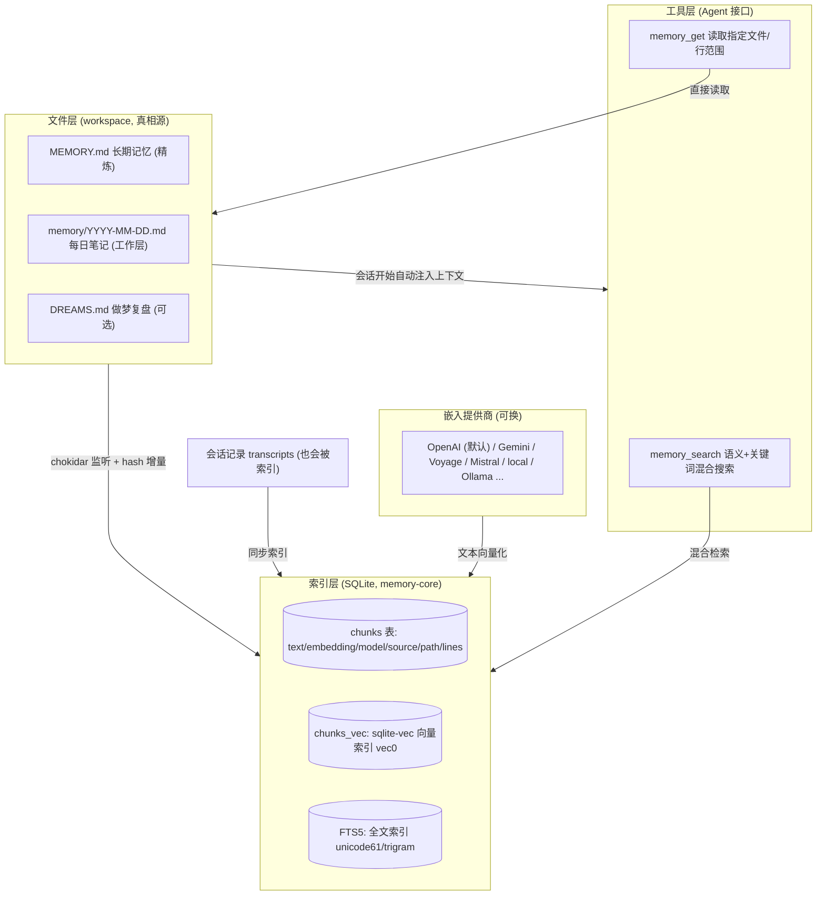
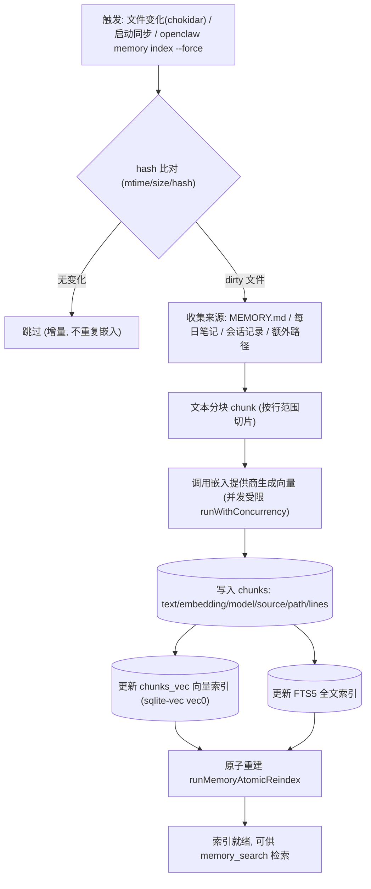
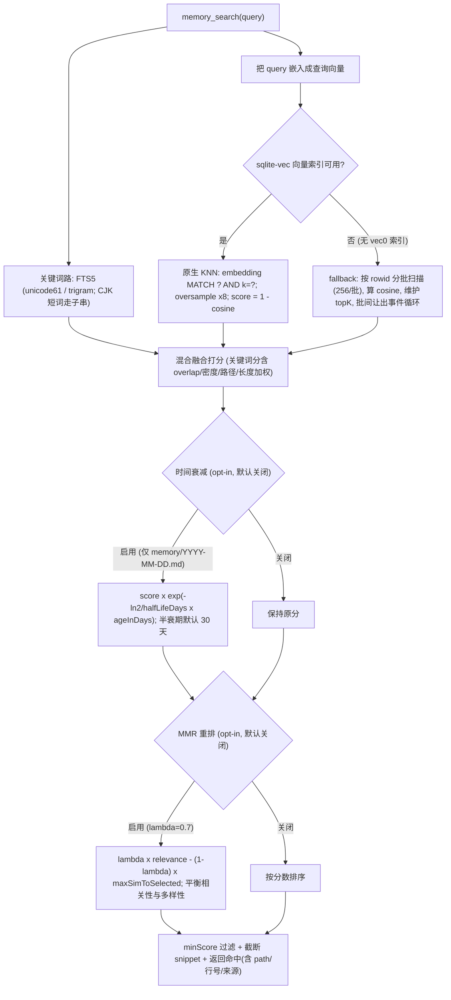
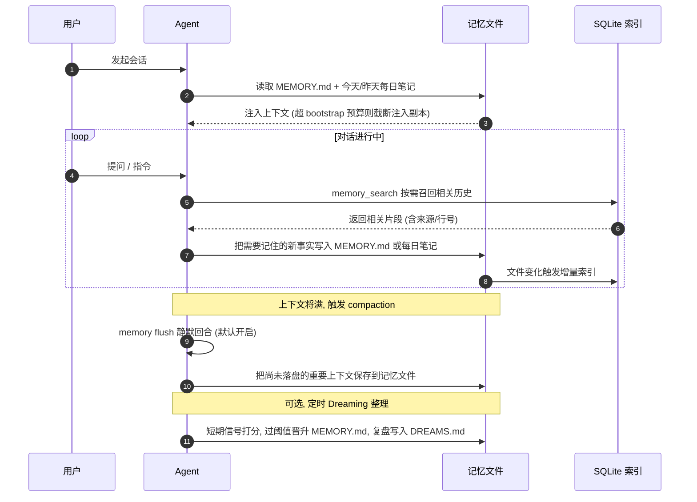
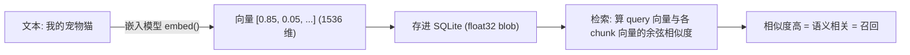
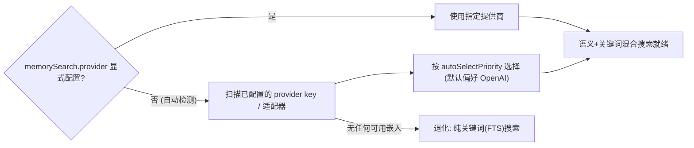
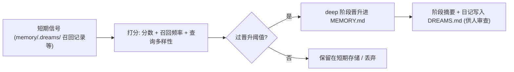

# OpenClaw 记忆系统实现详解

> 本文基于源码（`extensions/memory-core/`、`src/memory/`、`src/config/types.memory.ts`）和官方文档（`docs/concepts/memory.md`）梳理 OpenClaw 记忆系统的实现原理、检索机制、生命周期与能力边界，并配有详细的 mermaid 流程图。

---

## 一、核心理念：记忆即文件，没有隐藏状态

OpenClaw 记忆系统最重要的设计决定是：**AI 记住的一切，都是写在 agent 工作区里的纯 Markdown 文件**。模型不会"记得"任何没有落盘的东西，不存在藏在云端的黑盒状态。

> 来源：`docs/concepts/memory.md`
> “OpenClaw remembers things by writing **plain Markdown files** in your agent's workspace. The model only ‘remembers’ what gets saved to disk — there is no hidden state.”

由此带来三个特性：

- **可拥有**：记忆文件在你自己的工作区（默认 `~/.openclaw/workspace`），可读、可改、可删、可做版本控制。
- **可检索**：文件被切块、嵌入并建索引（SQLite），支持语义 + 关键词混合搜索。
- **可自维护**：自动加载、压缩前自动刷写、可选的 Dreaming 后台晋升，让长期记忆保持高信噪比。

记忆系统由内置插件 **`memory-core`** 提供（默认），并通过 `memory_search` / `memory_get` 两个工具暴露给 Agent。

---

## 二、整体架构

记忆系统分为三层：**文件层（真相源）**、**索引层（SQLite 检索）**、**工具层（Agent 接口）**，外加可插拔的**嵌入提供商**。



---

## 三、存储模型

### 3.1 文件层：三类记忆文件

| 文件 | 角色 | 加载方式 |
|------|------|----------|
| `MEMORY.md` | **长期记忆**：持久事实、偏好、决策、简短摘要 | 每次私聊会话开始**自动注入** prompt（超预算则截断注入副本，磁盘文件保持完整） |
| `memory/YYYY-MM-DD.md`（或 `…-<slug>.md`） | **每日笔记**：运行中的上下文、观察、会话摘要 | 今天 + 昨天自动加载；**全部进搜索索引**，但不会每轮塞进 bootstrap prompt |
| `DREAMS.md` | **做梦/整理**复盘记录（可选） | 供人审查 |

- 规范文件名为 `MEMORY.md`（`src/memory/root-memory-files.ts` 中 `CANONICAL_ROOT_MEMORY_FILENAME`），旧的 `memory.md` 为 legacy。
- 分工逻辑：`MEMORY.md` 是“精选薄层”，每日笔记是“详细工作层”；随时间由 Agent（或 Dreaming）把每日笔记中有价值内容**蒸馏**进 `MEMORY.md` 并清理过时条目。

### 3.2 索引层：SQLite 表结构（builtin 后端）

builtin 后端直接建在 `node:sqlite` 上（`extensions/memory-core/src/memory/manager-search.ts`），核心三张表：

| 表 | 作用 | 关键字段 |
|----|------|----------|
| `chunks` | 文本分块的真相表 | `id`、`path`、`start_line`、`end_line`、`text`、`embedding`、`source`、`model` |
| `chunks_vec` | `sqlite-vec` 的 `vec0` 向量索引（KNN 加速） | `id`、`embedding`（按嵌入模型维度建立） |
| FTS5 表 | 全文倒排索引 | tokenizer 支持 `unicode61` 与 `trigram`（CJK 友好） |

- `source` 区分来源（记忆文件 / 会话记录 / 额外路径）。
- `model` 字段隔离不同嵌入模型生成的向量，换模型不会串味。

---

## 四、写入与索引流程

记忆文件变化由 `chokidar` 文件监听触发（也支持启动同步、手动 `openclaw memory index`），按内容 hash 做**增量**索引（`extensions/memory-core/src/memory/manager-sync-ops.ts`）。



要点：

- **增量**：只有内容 hash 变化的文件才重新分块、嵌入、写索引。
- **会话记录也入索引**：不仅是记忆文件，session transcripts 也会被同步进索引，所以可以搜到“之前聊过的内容”。
- **原子重建**：重建走 `runMemoryAtomicReindex`，避免索引处于半成品状态。
- **嵌入缺失时**：无可用嵌入提供商则退化为纯关键词（FTS）索引/检索，仍可用。

---

## 五、混合检索流程（memory_search）

`memory_search` 不是简单关键词匹配，而是**向量语义 + 关键词的混合检索**，再叠加可选的时间衰减与 MMR 多样性重排（`manager-search.ts`、`mmr.ts`、`temporal-decay.ts`）。



关键实现细节：

- **向量召回**：优先用 `sqlite-vec` 的原生 KNN（`v.embedding MATCH ? AND k = ?`）。注意当前固定版本 **0.1.9 没有 ANN 索引**，vec0 内部是 **C 层 brute-force 线性扫描**（SIMD 优化），复杂度 `O(N × d)`，`k` 只保留 top-k；官方实测约 250k 向量内 <100ms（[issue #25](https://github.com/asg017/sqlite-vec/issues/25)）。候选量取 `limit × 8`（oversample），目的是给后续「融合 / minScore 过滤 / MMR 重排」更大候选池（**不是**补救近似召回，因为它本就是精确 KNN）。分数统一换算成余弦相似度 `score = 1 - dist`，落在 `[0, 1]`。
- **无索引兜底**：当 `vec0` 索引不可用时，按 `rowid` 游标**分批扫描**（每批 256 行）逐块计算余弦相似度并维护 top-K，批与批之间 `setImmediate` 让出事件循环，避免长时间阻塞主线程拖垮 I/O。
- **关键词侧**：FTS5 支持 `trigram` 分词器，对中文/日文/韩文这类 CJK 文本，源码对长度 < 3 的 CJK token 走子串匹配，所以**中文检索可用**。
- **时间衰减（可选）**：仅对带日期的每日笔记生效，按半衰期指数衰减旧笔记权重（`λ = ln2 / halfLifeDays`，半衰期默认 30 天）。
- **MMR 重排（可选）**：最大边际相关性（Carbonell & Goldstein, 1998），用 CJK-aware 分词 + Jaccard 相似度，`λ` 默认 0.7，避免返回一堆高度相似的重复片段。

---

## 六、记忆生命周期（一次会话视角）



---

## 七、嵌入（向量化）：原理、示例与提供商

### 7.1 什么是嵌入

嵌入（embedding / 向量化）= 用训练好的模型把"一段文字"变成"一串固定长度的数字"（一个向量）。这串数字是文字的"语义坐标"：**语义越接近的文字，向量方向越接近**。于是"找相关记忆"就变成纯数学问题——**比较两个向量的夹角（余弦相似度）**。

这正是它和关键词搜索的本质区别：关键词比"字面是否出现"，嵌入比"意思是否接近"。



OpenClaw 对**查询**和**文档**用不同的 `inputType`（很多嵌入模型是非对称的，分开处理能提升召回）：

```ts
// extensions/memory-core/src/memory/embeddings.ts:47-56
embedQuery: async (text, options) =>
  await provider.embed(text, { ...options, inputType: "query" }),
embedBatch: async (texts, options) =>
  await provider.embedBatch(texts, { ...options, inputType: "document" }),
```

### 7.2 手算示例：为什么能"听懂意思"

真实向量是 1536 维、由模型训练得到（人看不懂每一维代表什么）。这里**降到 3 维**便于手算，假设这 3 维恰好代表 `[与猫相关, 与编程相关, 与天气相关]`：

| 文本 | 向量 |
|------|------|
| 查询 query：`我的宠物猫` | `[0.85, 0.05, 0.05]` |
| 文档 A：`我家的猫叫咪咪` | `[0.90, 0.00, 0.10]` |
| 文档 B：`今天用 Python 写了排序` | `[0.00, 0.95, 0.05]` |
| 文档 C：`明天会下雨` | `[0.10, 0.00, 0.90]` |

余弦相似度公式（就是源码里的 `cosineSimilarity`）：`cos(θ) = (q · d) / (|q| × |d|)`

手算结果：

| 对比 | 点积 | 余弦相似度 |
|------|------|-----------|
| query · A | `0.85×0.9 + 0.05×0 + 0.05×0.1 = 0.770` | **≈ 0.997** |
| query · C | `0.85×0.1 + 0 + 0.05×0.9 = 0.130` | ≈ 0.168 |
| query · B | `0 + 0.05×0.95 + 0.05×0.05 = 0.050` | ≈ 0.062 |

**排序：A ≫ C > B。** 妙处在于：query `我的宠物猫` 和文档 A `我家的猫叫咪咪` **没有一个共同关键词**（"宠物猫" vs "猫/咪咪"），纯关键词搜索可能漏掉 A，但向量检索照样把 A 排第一——这就是语义检索的价值。

对应源码（没有向量索引时的 JS 兜底就是这个公式）：

```ts
// packages/memory-host-sdk/src/host/internal.ts:521-540
export function cosineSimilarity(a: number[], b: number[]): number {
  if (a.length === 0 || b.length === 0) {
    return 0;
  }
  const len = Math.min(a.length, b.length);
  let dot = 0;
  let normA = 0;
  let normB = 0;
  for (let i = 0; i < len; i += 1) {
    const av = a[i] ?? 0;
    const bv = b[i] ?? 0;
    dot += av * bv;
    normA += av * av;
    normB += bv * bv;
  }
  if (normA === 0 || normB === 0) {
    return 0;
  }
  return dot / (Math.sqrt(normA) * Math.sqrt(normB));
}
```

有 `vec0` 索引时则交给 `sqlite-vec` 的 `vec_distance_cosine`，再换算成相似度 `score = 1 - dist`（落在 `[0,1]`）：

```ts
// extensions/memory-core/src/memory/manager-search.ts:205-213 (有 vec0 索引时)
return rows.map((row) => ({
  id: row.id,
  path: row.path,
  startLine: row.start_line,
  endLine: row.end_line,
  score: 1 - row.dist, // 余弦距离 → 余弦相似度
  snippet: truncateUtf16Safe(row.text, params.snippetMaxChars),
  source: row.source,
}));
```

### 7.3 存储开销：1536 维到底多大？

- **1536 维 = 1536 个数字**，每个是 `float32`（4 字节）。向量以 `Float32Array` 转二进制 blob 存进 SQLite：

```ts
// extensions/memory-core/src/memory/manager-search.ts:13-14
const vectorToBlob = (embedding: number[]): Buffer =>
  Buffer.from(new Float32Array(embedding).buffer);
```

- 单个向量大小 = 1536 × 4 B = **6144 B ≈ 6 KB**。
- **关键：存的是 chunk（文本块）的向量，不是"每个文件一个"**。一个文件先按行范围切成若干 chunk，每个 chunk 各自嵌入、各存一个向量；`chunks` 表里同时存这块的原文 `text` 与其 `embedding`。

估算（仅向量部分，1536 维）：

| chunk 数 | 向量总量 |
|---------|---------|
| 100 | ≈ 0.6 MB |
| 1,000 | ≈ 6 MB |
| 10,000 | ≈ 60 MB |

- 即便上万条记忆，向量也就几十 MB，对现代磁盘微不足道；再加 chunk 原文（FTS + `text` 字段）整体仍是 MB 级。
- **维度随模型变**：`text-embedding-3-small`=1536，其他模型（如 `gemini-embedding-001`）维度不同；`chunks.model` 字段隔离不同模型向量，**换模型需重建索引**。
- **可降维省空间**：OpenAI `text-embedding-3` 系列支持 `dimensions` 截断（Matryoshka），adapter 已支持透传 `outputDimensionality`，需要时可用更低维度换更小存储 / 更快检索。

### 7.4 提供商与自动选择

> 来源：`docs/concepts/memory.md` + `extensions/memory-core/src/memory/provider-adapters.ts`

- **默认 OpenAI 嵌入**，有任一支持的 provider key 即**自动启用**语义搜索；没有则退化为纯关键词搜索。
- 可显式切换 `agents.defaults.memorySearch.provider`：
  - 远程：`openai`、`gemini`、`voyage`、`mistral`、`bedrock`、`github-copilot`、OpenAI 兼容端点；
  - 本地：`local`（`node-llama-cpp`，完全离线）、`ollama`。
- 适配器有 `autoSelectPriority`，自动选择时按优先级挑选；`local` 适配器为内置 builtin adapter。



---

## 八、可换的后端

配置类型 `MemoryBackend = "builtin" | "qmd"`（`src/config/types.memory.ts`），再加插件式后端与知识库层：

| 后端 | 类型 | 特点 |
|------|------|------|
| **builtin**（默认） | 内置 | SQLite，关键词 + 向量 + 混合检索，零额外依赖 |
| **QMD** | 内置可选 | 本地优先 sidecar，支持**重排序、查询扩展、索引工作区外目录**；`searchMode` 有 `query/search/vsearch`，可经 mcporter 常驻 |
| **Honcho** | 插件安装 | AI 原生跨会话记忆，用户建模，多 agent 感知 |
| **LanceDB** | 插件 | LanceDB 后端，自动召回/自动捕获，OpenAI 兼容嵌入 + 本地 Ollama 嵌入 |
| **memory-wiki** | 知识库层（不替代主后端） | 把持久记忆编译成带“声明 + 证据 + 矛盾追踪 + 仪表盘”的 wiki vault，提供 `wiki_search/wiki_get/wiki_apply/wiki_lint` |

---

## 九、自动化能力

### 9.1 自动加载
会话开始自动注入 `MEMORY.md` + 今/昨每日笔记，无需手动操作。

### 9.2 自动刷写（memory flush）
> 来源：`docs/concepts/memory.md`、`src/auto-reply/reply/memory-flush.ts`

在 compaction 压缩对话之前，OpenClaw 跑一个**静默回合**提醒 Agent 把重要上下文存进记忆文件，**默认开启**，防止压缩导致上下文丢失。可单独为该回合指定本地模型：

```json
{
  "agents": {
    "defaults": {
      "compaction": { "memoryFlush": { "model": "ollama/qwen3:8b" } }
    }
  }
}
```

### 9.3 Dreaming（做梦/整理）
可选的后台整理：收集短期信号、打分、只把过阈值的内容晋升进长期 `MEMORY.md`，复盘写入 `DREAMS.md`。



- **opt-in**：默认关闭；启用后 `memory-core` 自动管理一个循环 cron 做完整 dreaming sweep。
- **阈值化**：晋升必须通过分数、召回频率、查询多样性三道门槛。
- **可复盘**：阶段摘要与日记写入 `DREAMS.md`。
- **grounded backfill**：可用 `openclaw memory rem-backfill` 回放历史每日笔记，结果会暂存（staged）到短期存储，不直接写 `MEMORY.md`，支持 `--rollback` 回滚。

### 9.4 Commitments（短期承诺）
推断性的短期跟进（如“面试后跟进一下”），在后台隐藏回合推断，绑定同一 agent + channel，通过 heartbeat 到点投递；精确提醒仍用定时任务（cron）。

---

## 十、配置参考

| 配置键 | 说明 |
|--------|------|
| `memory.backend` | `builtin`（默认）/ `qmd` |
| `memory.citations` | 引用模式 `auto`/`on`/`off` |
| `memory.qmd.*` | QMD 后端：`searchMode`、`paths`、`sessions`、`update`、`limits`、`mcporter` 等 |
| `agents.defaults.memorySearch.provider` | 嵌入提供商（默认自动检测，偏好 OpenAI） |
| `agents.defaults.compaction.memoryFlush.model` | 刷写回合专用模型覆盖 |
| MMR / 时间衰减 | `memorySearch` 下的可选调优项，**默认均关闭**（详见 `docs/concepts/memory-search`、`docs/reference/memory-config`） |

CLI：

```bash
openclaw memory status          # 查看索引状态与提供商
openclaw memory search "query"  # 命令行检索
openclaw memory index --force   # 重建索引
openclaw memory rem-backfill …  # 回放历史笔记到短期 dreaming 存储
```

---

## 十一、关键源码索引（repo-root 相对路径）

| 路径 | 职责 |
|------|------|
| `src/memory/root-memory-files.ts` | `MEMORY.md` 规范/legacy 文件名解析与修复 |
| `src/config/types.memory.ts` | 记忆配置类型、后端枚举、QMD 配置 |
| `extensions/memory-core/` | 记忆核心插件（默认后端 + 工具提供者） |
| `extensions/memory-core/src/memory/manager.ts` | 记忆管理器主入口 |
| `extensions/memory-core/src/memory/manager-search.ts` | 混合搜索：FTS + 向量（KNN / 分批扫描） |
| `extensions/memory-core/src/memory/manager-sync-ops.ts` | 文件监听（chokidar）+ 增量索引同步 |
| `extensions/memory-core/src/memory/embeddings.ts` | 嵌入提供商运行时 |
| `extensions/memory-core/src/memory/provider-adapters.ts` | 嵌入提供商适配（local + 远程注册） |
| `extensions/memory-core/src/memory/mmr.ts` | MMR 多样性重排 |
| `extensions/memory-core/src/memory/temporal-decay.ts` | 每日笔记时间衰减 |
| `extensions/memory-core/src/memory/qmd-manager.ts` | QMD 后端管理 |
| `src/memory-host-sdk/` | 记忆 host SDK（引擎/存储/查询/嵌入入口） |
| `packages/memory-host-sdk/src/host/internal.ts` | 底层向量运算（`cosineSimilarity`）、嵌入解析（`parseEmbedding`） |
| `src/auto-reply/reply/memory-flush.ts` | 压缩前自动刷写 |
| `extensions/memory-wiki/` | 知识库 wiki 层 |
| `docs/concepts/memory.md` 等 | 官方概念文档 |

---

## 十二、边界与限制

- **透明但需留意**：模型只记得写到磁盘的内容，没写就没记住。
- **注入有预算**：`MEMORY.md` 过大时磁盘文件完整保留，但**注入 prompt 的副本会被截断**（提示把细节移回每日笔记，或调高 bootstrap 预算）。用 `/context list`、`/context detail`、`openclaw doctor` 查看 raw vs injected 大小与截断状态。
- **记忆不强制策略**：能保存“审批/权限/过期”等上下文，但**不执行**硬控制——硬约束靠审批设置、沙箱、定时任务。
- **容量与召回**：每日笔记/文件可持续累积（受磁盘 + 索引），长期可检索知识量很大；但“每轮直接看到的”是精选注入 + 按需 `memory_search` 召回的组合。
- **opt-in 项**：MMR 与时间衰减默认关闭，Dreaming 默认关闭，按需开启。

---

## 十三、小结

- **实现**：Markdown 文件（`MEMORY.md` + 每日笔记 + `DREAMS.md`）作为真相源；SQLite 上的 FTS5 全文检索（含 CJK trigram）+ `sqlite-vec` 向量余弦相似度做**混合召回**，可选时间衰减与 MMR 重排；`memory_search` / `memory_get` 暴露给 Agent。
- **能力**：跨会话持久、语义可搜（含中文）、文件变更增量索引、会话记录也可检索、自动加载、压缩前自动刷写、可选 Dreaming 自动晋升、短期 Commitments 跟进；后端可从内置 SQLite 升级到 QMD / Honcho / LanceDB，嵌入可云可本地。
- **本质优势**：相比网页版 AI 每开新对话即失忆，OpenClaw 的记忆是**你自己拥有、可检索、会自我整理**的文件库。
