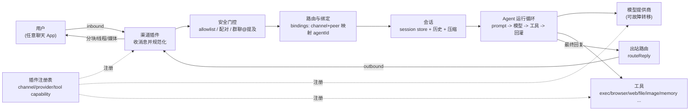
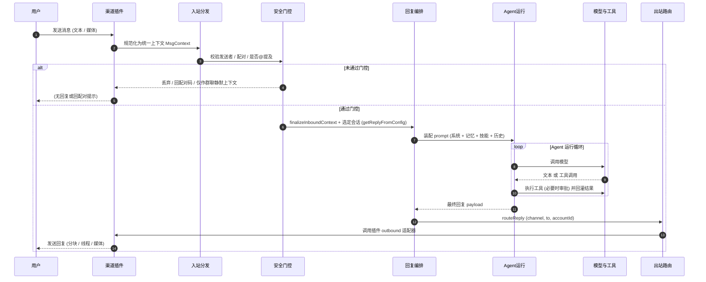
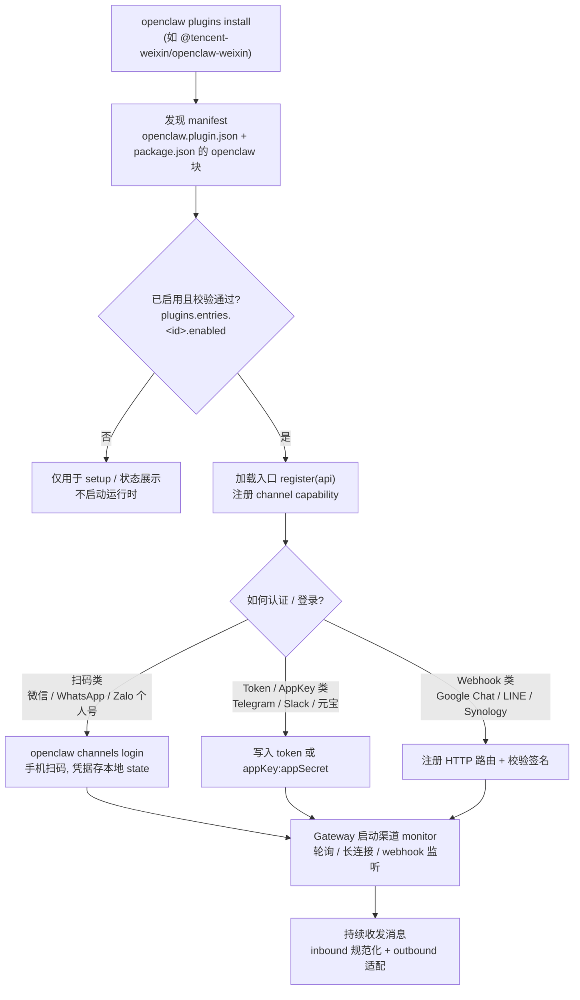
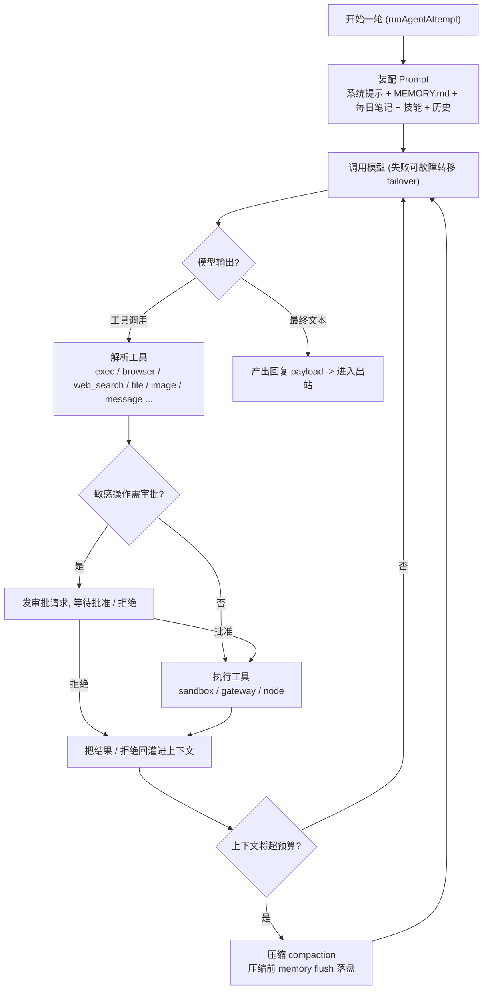
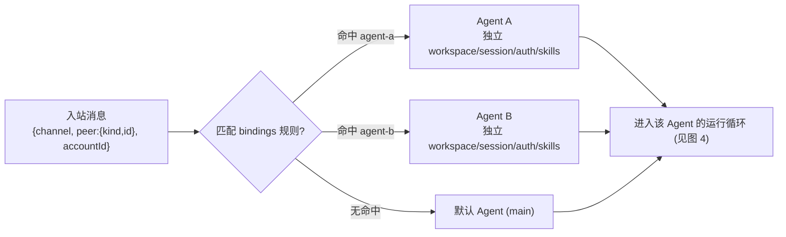
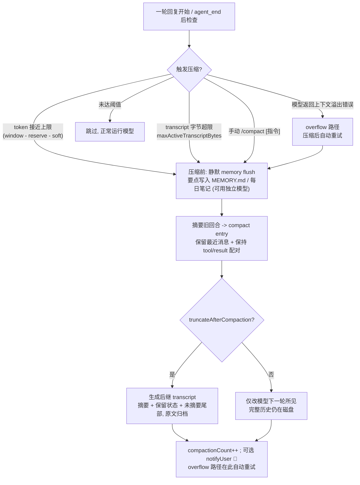
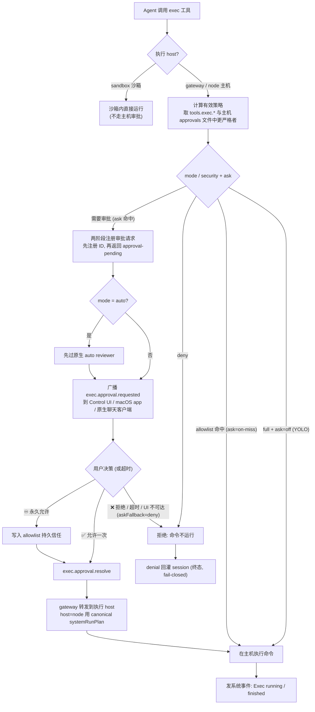
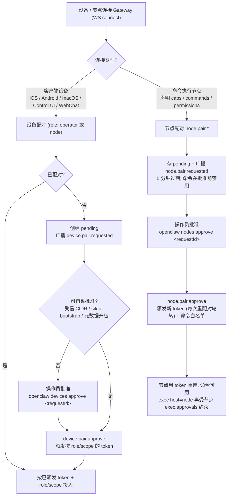

# OpenClaw 项目完整概览

> 本文档是 OpenClaw 项目的中文概览指南，涵盖项目定位、核心能力、使用方法、架构设计等内容。

---

## 一、项目简介

**OpenClaw** 是一个开源的（MIT 许可证）**个人 AI 助手网关系统**。它运行在你自己的设备上，将你日常使用的各种聊天应用（WhatsApp、Telegram、微信等）连接到 AI 代理（Agent），打造一个始终在线、自托管、多渠道的 AI 助手。

- **官网**：https://openclaw.ai
- **文档**：https://docs.openclaw.ai
- **仓库**：https://github.com/openclaw/openclaw

### 核心理念

| 特性 | 说明 |
|------|------|
| 自托管 | 运行在你自己的硬件上，数据完全由你控制 |
| 多渠道网关 | 一个 Gateway 进程同时服务 20+ 个聊天平台 |
| Agent 原生 | 为 AI 编程代理设计，支持工具调用、会话管理、记忆和多代理路由 |
| 可扩展 | 通过插件系统添加新渠道、模型提供商、工具和技能 |
| 开源 | MIT 许可证，社区驱动 |

---

## 二、系统架构

```
┌─────────────────────────────────────────────────┐
│                   Gateway（核心）                  │
│  ┌───────────┐  ┌──────────┐  ┌──────────────┐  │
│  │ Agent 运行时│  │ 会话管理  │  │  路由 & 配对  │  │
│  └───────────┘  └──────────┘  └──────────────┘  │
│  ┌───────────┐  ┌──────────┐  ┌──────────────┐  │
│  │  工具系统   │  │ 插件系统  │  │  记忆 & 技能  │  │
│  └───────────┘  └──────────┘  └──────────────┘  │
└────────┬──────────────┬──────────────┬──────────┘
         │              │              │
    ┌────▼────┐   ┌─────▼─────┐  ┌────▼────┐
    │ 聊天渠道  │   │ AI 模型    │  │ 客户端   │
    │ WhatsApp │   │ Anthropic  │  │ CLI     │
    │ Telegram │   │ OpenAI     │  │ Web UI  │
    │ Discord  │   │ Gemini     │  │ macOS   │
    │ 微信/飞书 │   │ Ollama     │  │ iOS     │
    │ ...20+   │   │ ...35+     │  │ Android │
    └─────────┘   └───────────┘  └─────────┘
```

### 各层职责

- **Gateway**：中央控制面板，管理会话、路由消息、协调工具调用
- **Agent 运行时**：内嵌的 AI 代理，处理用户消息并生成回复
- **渠道层**：连接各个聊天平台，收发消息
- **模型层**：对接 AI 模型提供商，执行推理
- **工具层**：为 Agent 提供操作能力（执行命令、浏览网页、文件操作等）
- **插件系统**：可扩展的注册机制，支持添加新渠道、提供商、工具

### 端到端流程图

上面的 ASCII 图描述的是**静态分层**。下面用 mermaid 补一套**动态流程图**（共 8 张），覆盖从"用户在聊天工具发消息"到"AI 回复发回聊天工具"的完整链路，以及渠道接入、Agent 循环、多代理路由、会话压缩、工具审批、设备配对等关键子流程。图中标注的函数/路径均为真实源码锚点。

#### 1. 数据流总览

一条消息进出 OpenClaw 的整体数据流（动态视角，区别于上面的静态分层图）：



> 源码锚点：入站 `src/auto-reply/dispatch.ts`（`dispatchInboundMessage`）；出站 `src/auto-reply/reply/route-reply.ts`（`routeReply` 经 `getLoadedChannelPlugin` 找到渠道插件的 outbound 适配器）。

#### 2. 消息端到端时序

一次完整问答的时序，包含门控分支与 Agent 内部循环：



> 源码锚点：`getReplyFromConfig`（`src/auto-reply/reply/get-reply.ts`）→ `runReplyAgent`（`src/auto-reply/reply/agent-runner.ts`）→ `runAgentTurnWithFallback`（`src/auto-reply/reply/agent-runner-execution.ts`）→ `runAgentAttempt`（`src/agents/command/attempt-execution.ts`）；渠道回合装配见 `src/channels/turn/kernel.ts`。

#### 3. 渠道接入与插件生命周期

从安装一个聊天渠道插件，到它真正开始收发消息（以微信、Telegram、Google Chat 等不同登录方式为例）：



> 源码锚点：插件发现/加载见 `docs/plugins/architecture.md`；渠道插件职责契约见 `docs/plugins/sdk-channel-plugins.md`；官方/外部渠道目录见 `scripts/lib/official-external-channel-catalog.json`；bundled 入口示例见 `extensions/telegram/index.ts`。

#### 4. Agent 运行循环（model loop）

Agent 不是"一问一答"，而是"推理 → 工具调用 → 回灌 → 再推理"的循环，直到产出最终文本：



> 源码锚点：`src/agents/command/attempt-execution.ts`（`runAgentAttempt`）；工具发送回渠道走核心共享的 `message` 工具，见 `docs/plugins/sdk-channel-plugins.md`。

#### 5. 多 Agent 路由（bindings）

一个 Gateway 可隔离运行多个 Agent，入站消息按 `bindings` 规则路由到不同 Agent（各自独立 workspace / session / auth / skills）：



> 源码锚点：路由匹配 `match.channel` / `match.peer.kind` / `match.peer.id`，配置示例见 `docs/channels/yuanbao.md` 的"多 Agent 路由"一节与 `docs/channels/channel-routing.md`。

#### 6. 会话压缩 compaction 生命周期

长对话接近模型上下文上限时，OpenClaw 会把旧回合摘要成 compact entry；压缩前先静默把要点落盘到记忆文件，避免上下文丢失：



> 源码锚点：`src/auto-reply/reply/agent-runner-memory.ts`（`runPreflightCompactionIfNeeded` + `runMemoryFlushIfNeeded`）、`src/agents/sessions/agent-session.ts`（`checkCompaction`：overflow 自动重试 / threshold 不重试）；配置见 `docs/concepts/compaction.md` 的 `agents.defaults.compaction.*`。

#### 7. 工具审批流（exec approval）

Agent 在真实主机（gateway / node）执行命令受"工具策略 + 白名单 +（可选）人工审批"三重门控；沙箱执行不走主机审批：



> 源码锚点：`src/agents/bash-tools.exec.ts`（`createExecTool` 解析 host/security/ask）、`src/gateway/server-methods/exec-approval.ts`（两阶段注册 + 广播）、`src/infra/exec-approval-channel-runtime.ts`（渠道原生审批投递）；策略说明见 `docs/tools/exec-approvals.md`。

#### 8. 设备 / 节点配对（pairing）

OpenClaw 有两条配对轨：**设备配对**（客户端如 iOS/Android/macOS/Control UI 连接 Gateway）与**节点配对**（提供命令执行能力的节点）。注意这与图 2 里的"聊天渠道 DM 配对"是不同的东西：



> 源码锚点：设备配对 `src/infra/device-pairing.ts`（`approveDevicePairing`）+ `src/gateway/server-methods/devices.ts`；节点配对 `src/infra/node-pairing.ts`（`approveNodePairing`）+ `src/gateway/node-connect-reconcile.ts`（`reconcileNodePairingOnConnect`）；流程说明见 `docs/gateway/pairing.md`。

---

## 三、安装与使用

### 环境要求

- **Node.js**：Node 24（推荐）或 Node 22.16+
- **操作系统**：macOS、Linux、Windows（WSL2 推荐）
- **AI 模型 API Key**：至少一个模型提供商的密钥

### 安装方式

**方式一：一键安装（推荐）**

```bash
# macOS / Linux
curl -fsSL https://openclaw.ai/install.sh | bash

# Windows (PowerShell)
iwr -useb https://openclaw.ai/install.ps1 | iex
```

**方式二：npm 全局安装**

```bash
npm install -g openclaw@latest
# 或
pnpm add -g openclaw@latest
```

**方式三：从源码构建**

```bash
git clone https://github.com/openclaw/openclaw.git
cd openclaw
pnpm install
pnpm ui:build
pnpm build
```

### 快速开始

```bash
# 1. 运行引导向导（约 2 分钟）
openclaw onboard --install-daemon

# 2. 检查 Gateway 状态
openclaw gateway status

# 3. 打开浏览器控制面板
openclaw dashboard

# 4. 通过 CLI 与 AI 对话
openclaw agent --message "你好" --thinking high

# 5. 发送消息到指定联系人
openclaw message send --to +1234567890 --message "Hello from OpenClaw"
```

### 配置文件

配置文件位于 `~/.openclaw/openclaw.json`，示例：

```json5
{
  channels: {
    whatsapp: {
      allowFrom: ["+15555550123"],
      groups: { "*": { requireMention: true } },
    },
  },
  messages: { groupChat: { mentionPatterns: ["@openclaw"] } },
}
```

### 常用 CLI 命令

| 命令 | 说明 |
|------|------|
| `openclaw onboard` | 引导设置向导 |
| `openclaw gateway status` | 查看 Gateway 状态 |
| `openclaw dashboard` | 打开 Web 控制面板 |
| `openclaw agent --message "..."` | 通过 CLI 与 Agent 对话 |
| `openclaw channels status` | 查看已连接的渠道状态 |
| `openclaw agents list` | 列出所有 Agent |
| `openclaw agents add <name>` | 添加新 Agent |
| `openclaw nodes status` | 查看已配对的设备节点 |
| `openclaw browser start` | 启动 Agent 浏览器 |
| `openclaw config set <key> <value>` | 修改配置 |
| `openclaw doctor` | 诊断和修复常见问题 |
| `openclaw update --channel stable` | 更新到指定渠道版本 |

---

## 四、完整能力清单

### 4.1 核心工具

Agent 的所有操作都通过**工具（Tools）**完成。OpenClaw 提供以下内置工具：

#### 命令执行（`exec` / `process`）

- 在工作区内运行 shell 命令，支持前台和后台执行
- 支持伪终端（PTY）、超时控制、环境变量覆盖
- 支持三种执行位置：`sandbox`（沙箱）、`gateway`（网关主机）、`node`（远程节点）
- 内置安全审批机制，敏感操作需人工确认
- 配置 `tools.exec.host`、`tools.exec.security`、`tools.exec.ask` 控制行为

#### 浏览器自动化（`browser`）

- 控制独立的 Chromium 浏览器配置文件（与个人浏览器完全隔离）
- 支持操作：导航、点击、输入、拖拽、截图、生成 PDF、快照
- 支持多配置文件：`openclaw`（默认）、`work`、`remote` 等
- 也支持通过 Chrome MCP 附加到用户的真实浏览器会话
- 支持 Chrome / Brave / Edge / Chromium

#### 网络搜索（`web_search` / `x_search` / `web_fetch`）

支持 10+ 个搜索引擎提供商：

| 提供商 | 特点 |
|--------|------|
| Brave Search | 独立搜索引擎，隐私优先 |
| Perplexity | AI 驱动的搜索 |
| Google Gemini | 通过 Gemini grounding 搜索 |
| Grok Search | xAI 搜索 |
| Kimi Search | 月之暗面搜索 |
| Firecrawl | 网页爬取与结构化提取 |
| Tavily | 搜索 API |
| Exa | 语义搜索 |
| SearXNG | 自托管元搜索引擎 |
| DuckDuckGo | 隐私搜索 |

- `x_search`：搜索 X（Twitter）帖子
- `web_fetch`：抓取指定 URL 内容
- 结果缓存 15 分钟（可配置）

#### 文件操作（`read` / `write` / `edit` / `apply_patch`）

- 在 Agent 工作区内读取、写入、编辑文件
- 支持多块补丁应用（multi-hunk patches）

#### 代码沙箱执行（`code_execution`）

- 在远程沙箱中运行 Python 代码
- 用于数据分析、计算等场景

#### 消息发送（`message`）

- 跨所有已连接渠道发送消息
- 支持指定渠道和接收者

#### Canvas 画布（`canvas`）

- 在配对设备上渲染实时可控的 Canvas 界面
- 支持代码注入（`canvas.eval`）、截图（`canvas.snapshot`）、展示

#### 定时任务（`cron` / `gateway`）

- 管理定时作业（Cron jobs）和心跳调度

### 4.2 图片能力

#### 图片分析（`image`）

- 理解和分析发送给 Agent 的图片内容
- 基于视觉模型（如 GPT-4o、Gemini）

#### 图片生成（`image_generate`）

| 提供商 | 默认模型 | 编辑支持 |
|--------|---------|---------|
| OpenAI | gpt-image-1 | 是（最多 5 张） |
| Google Gemini | gemini-3.1-flash-image-preview | 是 |
| fal | fal-ai/flux/dev | 是 |
| MiniMax | image-01 | 是（主题参考） |

### 4.3 语音能力

#### 文本转语音（TTS）

| 提供商 | 需要 API Key | 说明 |
|--------|-------------|------|
| ElevenLabs | 是 | 高质量语音 |
| Microsoft | 否（免费） | 基于 Edge TTS 服务 |
| OpenAI | 是 | 多种声音可选 |

- 支持语音笔记转录（Voice note transcription）
- 支持自动语音摘要

### 4.4 记忆系统

Agent 通过 Markdown 文件实现持久化记忆：

- **`MEMORY.md`**：长期记忆（偏好、决策、事实），每次 DM 会话开始时加载
- **`memory/YYYY-MM-DD.md`**：每日笔记，自动加载今天和昨天的笔记
- **`memory_search`**：语义搜索（向量相似度 + 关键词混合搜索）
- **`memory_get`**：读取特定记忆文件

三种存储后端：

| 后端 | 特点 |
|------|------|
| 内置（SQLite） | 开箱即用，支持关键词 + 向量混合搜索 |
| QMD | 本地优先，支持重排序和查询扩展 |
| Honcho | AI 原生跨会话记忆，用户建模 |

嵌入提供商自动检测：有 OpenAI / Gemini / Voyage / Mistral API Key 即自动启用语义搜索。

### 4.5 会话管理

- 每个发送者 / 群组拥有独立的会话
- 支持会话列表、历史回溯、跨会话发送
- 自动会话压缩（compaction）控制上下文长度
- 压缩前自动将重要上下文刷写到记忆文件
- 会话存储为 JSONL 文件：`~/.openclaw/agents/<agentId>/sessions/<SessionId>.jsonl`

### 4.6 多代理路由

在一个 Gateway 中运行多个隔离的 Agent：

```bash
# 创建新 Agent
openclaw agents add work

# 查看所有 Agent 及绑定
openclaw agents list --bindings
```

每个 Agent 拥有：
- 独立的工作区（workspace）
- 独立的会话存储（session store）
- 独立的认证配置（auth profiles）
- 独立的技能（skills）
- 通过绑定规则（bindings）路由消息

### 4.7 Skills 技能系统

Skills 是 Markdown 格式的指令文件，注入到 Agent 的系统提示词中：

- **加载优先级**：工作区 > 项目 > 个人 > 共享 > 内置 > 额外目录
- 支持条件加载（基于环境、配置、二进制是否存在）
- **ClawHub**：公共技能市场，可浏览、安装和同步技能

```bash
openclaw skills install <skill-name>
openclaw skills list
```

---

## 五、支持的聊天渠道

### 内置渠道

| 渠道 | 说明 |
|------|------|
| WhatsApp | Web 协议，支持群聊 |
| Telegram | Bot API，最快上手 |
| Discord | Bot Token |
| Slack | App/Bot |
| Signal | 通过 signal-cli |
| iMessage | macOS 原生 |
| Google Chat | Workspace App |
| IRC | 标准协议 |
| BlueBubbles | iMessage 桥接 |

### 插件渠道

| 渠道 | 说明 |
|------|------|
| Microsoft Teams | 企业通信 |
| Matrix | 去中心化协议 |
| Feishu（飞书） | 字节跳动企业通信 |
| LINE | 日本流行通信 |
| Mattermost | 自托管团队通信 |
| Nextcloud Talk | Nextcloud 内置通信 |
| Nostr | 去中心化社交协议 |
| Synology Chat | 群晖 NAS 通信 |
| Tlon | Urbit 生态通信 |
| Twitch | 直播弹幕 |
| Zalo | 越南流行通信 |
| WeChat（微信） | 中国最大通信平台 |
| WebChat | 网页聊天 |
| Voice Call | 语音通话 |

### 渠道安全

- **Allowlist**：控制谁可以给 Agent 发消息
- **配对机制（Pairing）**：设备/用户需要配对批准
- **群聊 @mention**：群聊中需要 @提及 才激活 Agent

---

## 六、支持的 AI 模型提供商

支持 35+ 个模型提供商：

### 主流云端

| 提供商 | API Key 环境变量 |
|--------|------------------|
| Anthropic (Claude) | `ANTHROPIC_API_KEY` |
| OpenAI (GPT) | `OPENAI_API_KEY` |
| Google Gemini | `GEMINI_API_KEY` |
| Mistral | `MISTRAL_API_KEY` |

### 国内厂商

| 提供商 | 说明 |
|--------|------|
| 通义千问（Qwen） | 阿里云 |
| Moonshot（Kimi） | 月之暗面 |
| 智谱（GLM） | 智谱 AI |
| MiniMax | MiniMax |
| 千帆（Qianfan） | 百度 |
| 小米（Xiaomi） | 小米 |
| ZAI | ZAI |

### 开源/自托管

| 提供商 | 说明 |
|--------|------|
| Ollama | 本地模型运行 |
| vLLM | 高性能推理服务 |
| SGLang | 结构化生成 |
| LiteLLM | 多模型代理 |

### 代理/网关

| 提供商 | 说明 |
|--------|------|
| OpenRouter | 多模型路由 |
| Vercel AI Gateway | Vercel 平台 |
| Cloudflare AI Gateway | Cloudflare 平台 |
| GitHub Copilot | GitHub 集成 |
| AWS Bedrock | AWS 平台 |
| NVIDIA | GPU 加速推理 |
| HuggingFace | 开源模型社区 |
| Together | GPU 云推理 |

支持 **模型故障转移（failover）**：主模型不可用时自动切换到备用模型。

---

## 七、设备节点系统

### 节点类型

| 节点 | 能力 |
|------|------|
| macOS 菜单栏应用 | Gateway + 节点模式，Canvas、摄像头 |
| iOS 应用 | Canvas、摄像头、屏幕录制、位置、语音 |
| Android 应用 | 聊天、语音、Canvas、摄像头、设备命令 |
| 无头节点主机 | 远程命令执行（`exec host=node`） |

### 节点配对

```bash
# 查看设备列表
openclaw devices list

# 批准配对请求
openclaw devices approve <requestId>

# 查看节点状态
openclaw nodes status
```

---

## 八、自动化与工作流

### Lobster 工作流引擎

Lobster 是一个类型化的工作流运行时，特点：

- **一次调用代替多次交互**：将多步操作封装为单次工具调用
- **内置审批关卡**：副作用操作（发邮件、发评论）需明确批准
- **可恢复执行**：暂停的工作流返回 resume token，批准后继续执行
- **确定性管道**：管道即数据，可日志记录、diff 对比、重放和审查

```json
{
  "action": "run",
  "pipeline": "exec --json --shell 'inbox list --json' | exec --stdin json --shell 'inbox categorize --json' | approve --prompt 'Apply changes?'",
  "timeoutMs": 30000
}
```

### 定时任务

- 通过 `cron` 工具管理定时作业
- 支持心跳调度（Heartbeat scheduling）

---

## 九、工具配置

### 允许/拒绝列表

```json5
{
  tools: {
    allow: ["group:fs", "browser", "web_search"],
    deny: ["exec"],
  },
}
```

### 工具配置文件（Profiles）

| Profile | 包含的工具 |
|---------|-----------|
| `full` | 所有工具（默认） |
| `coding` | 文件 I/O、运行时、会话、记忆、图片 |
| `messaging` | 消息、会话列表/历史/发送/状态 |
| `minimal` | 仅 `session_status` |

### 工具分组

| 分组 | 包含的工具 |
|------|-----------|
| `group:runtime` | exec, bash, process, code_execution |
| `group:fs` | read, write, edit, apply_patch |
| `group:sessions` | sessions_list, sessions_history, sessions_send 等 |
| `group:memory` | memory_search, memory_get |
| `group:web` | web_search, x_search, web_fetch |
| `group:ui` | browser, canvas |
| `group:automation` | cron, gateway |
| `group:messaging` | message |
| `group:nodes` | nodes |

---

## 十、项目目录结构

```
openclaw/
├── src/                    # 源代码（TypeScript ESM）
│   ├── cli/                # CLI 命令入口
│   ├── commands/           # CLI 子命令实现
│   ├── channels/           # 内置渠道实现
│   ├── gateway/            # Gateway 核心与协议
│   │   └── protocol/       # 网关 Wire 协议
│   ├── plugins/            # 插件发现、加载、注册
│   ├── plugin-sdk/         # 插件开发 SDK（公共接口）
│   ├── media/              # 媒体管道
│   ├── routing/            # 消息路由
│   ├── infra/              # 基础设施
│   ├── telegram/           # Telegram 渠道
│   ├── discord/            # Discord 渠道
│   ├── slack/              # Slack 渠道
│   ├── signal/             # Signal 渠道
│   ├── imessage/           # iMessage 渠道
│   └── web/                # WhatsApp Web
├── docs/                   # 文档（Mintlify 托管）
├── apps/                   # 原生应用
│   ├── macos/              # macOS 菜单栏应用
│   ├── ios/                # iOS 节点应用
│   └── android/            # Android 节点应用
├── skills/                 # 内置技能
├── scripts/                # 构建和开发脚本
├── dist/                   # 构建产物
├── package.json            # 包定义（版本、依赖等）
└── CHANGELOG.md            # 变更日志
```

---

## 十一、开发与贡献

### 开发环境搭建

```bash
git clone https://github.com/openclaw/openclaw.git
cd openclaw
pnpm install
pnpm ui:build          # 构建 UI（首次自动安装 UI 依赖）
pnpm build             # 完整构建

# 开发循环（源码/配置变更自动重载）
pnpm gateway:watch

# 运行 CLI（开发模式）
pnpm openclaw ...
```

### 常用开发命令

| 命令 | 说明 |
|------|------|
| `pnpm install` | 安装依赖 |
| `pnpm build` | 类型检查 + 构建 |
| `pnpm tsgo` | TypeScript 类型检查 |
| `pnpm check` | 代码检查（lint + format） |
| `pnpm format:fix` | 自动修复格式 |
| `pnpm test` | 运行测试（Vitest） |
| `pnpm test:coverage` | 运行测试并生成覆盖率 |
| `pnpm gateway:watch` | 开发模式运行 Gateway |

### 技术栈

- **语言**：TypeScript（ESM）
- **运行时**：Node.js 22+ / Bun
- **包管理**：pnpm
- **构建**：ESBuild
- **测试**：Vitest（V8 覆盖率，70% 阈值）
- **Lint/Format**：Oxlint + Oxfmt
- **文档**：Mintlify
- **原生应用**：SwiftUI (macOS/iOS)、Kotlin (Android)

---

## 十二、插件系统

OpenClaw 有三层扩展机制：

### 工具（Tools）
Agent 可以调用的类型化函数（如 `exec`、`browser`、`web_search`）。

### 技能（Skills）
注入到系统提示词的 Markdown 文件，教 Agent 何时以及如何使用工具。

### 插件（Plugins）
可以注册任意组合能力的包：渠道、模型提供商、工具、技能、语音、图片生成等。

```bash
# 安装外部插件
openclaw plugins install <plugin-name>

# 查看已安装插件
openclaw plugins list
```

插件清单文件：`openclaw.plugin.json`，定义插件 ID、渠道、提供商等元数据。

---

## 十三、关键概念

| 概念 | 说明 |
|------|------|
| **Gateway** | 中央进程，管理所有渠道连接、会话路由、工具调度 |
| **Agent** | 隔离的 AI 大脑，有自己的工作区、会话和认证 |
| **Channel** | 聊天平台连接（WhatsApp、Telegram 等） |
| **Node** | 配对的外设设备（iOS/Android/macOS） |
| **Session** | 一次对话上下文，存储为 JSONL 文件 |
| **Workspace** | Agent 的工作目录，包含记忆、技能、配置文件 |
| **Skill** | 教 Agent 使用工具的 Markdown 指令文件 |
| **Plugin** | 可扩展包，注册渠道/提供商/工具/技能 |
| **Compaction** | 长对话自动压缩以控制上下文窗口大小 |
| **Pairing** | 设备/用户配对机制，控制访问权限 |
| **Binding** | 多 Agent 模式下的消息路由规则 |

---

## 十四、总结

OpenClaw 是一个功能全面的个人 AI 助手基础设施，它的核心价值在于：

1. **统一入口**：通过一个 Gateway 连接所有聊天平台，无论你在哪个 App 都能找到你的 AI 助手
2. **完全自主**：自托管、数据自控、模型自选、工具可配置
3. **能力丰富**：命令执行、浏览器自动化、网络搜索、文件操作、图片生成/分析、语音合成、记忆系统、工作流自动化
4. **高度可扩展**：插件系统支持添加新渠道、模型、工具和技能
5. **多设备协同**：macOS/iOS/Android 节点配对，支持 Canvas、摄像头、语音等
6. **生产就绪**：内置安全控制（allowlist、审批、沙箱）、会话管理、模型故障转移

---

## 十五、OpenClaw 与编程工具对比

OpenClaw 常被拿来和其他 AI 编程工具比较。以下是它们的定位和关键差异。

### 定位对比总览

| 维度 | OpenClaw | Cursor | Claude Code | Google Antigravity |
|------|----------|--------|-------------|-------------------|
| **定位** | 多渠道 AI 助手网关 | AI 驱动的代码编辑器 | 终端 AI 编程代理 | Google AI 模型/代理平台 |
| **核心用途** | 个人 AI 助手基础设施 | 写代码、改代码 | 命令行编程助手 | AI 推理与工具调用 |
| **运行形态** | 后台 Gateway 守护进程 | 桌面 IDE 应用 | CLI 终端工具 | 云端 API 服务 |
| **自托管** | 是（完全自托管） | 否（SaaS + 本地客户端） | 是（本地运行） | 否（Google 云端） |
| **开源** | 是（MIT） | 否（专有） | 是（Apache 2.0） | 否（专有） |

### 详细维度对比

#### 1. 核心设计目标

**OpenClaw — "随时随地的 AI 助手"**
- 设计为一个**多渠道消息网关**，核心价值是让你在任何聊天 App 里都能和 AI 对话
- 编程只是它众多能力之一（还有搜索、图片、语音、自动化等）
- 更像是"AI 助手的操作系统"，而不是一个编程工具

**Cursor — "AI 增强的 IDE"**
- 基于 VS Code 构建，专为**代码编辑**设计
- 核心体验是编辑器内的 AI 辅助：自动补全、内联编辑、聊天对话
- Agent 模式可以自主完成多步编程任务
- 定位是取代传统 IDE

**Claude Code — "终端里的编程搭档"**
- Anthropic 的命令行编程代理，直接在终端运行
- 专注于**代码理解和修改**：读文件、改文件、运行命令
- 无 GUI，纯终端交互，适合熟悉命令行的开发者
- 对大型代码库有深度理解能力

**Google Antigravity — "Google 的 AI 模型平台"**
- 在 OpenClaw 中作为模型提供商出现（`google-antigravity`）
- 提供 AI 推理能力和工具调用接口
- 更偏向底层 AI 服务，不是面向终端用户的编程工具

#### 2. 交互方式

| 特性 | OpenClaw | Cursor | Claude Code |
|------|----------|--------|-------------|
| **交互入口** | 20+ 聊天 App + CLI + Web UI + 原生 App | IDE 编辑器界面 | 终端命令行 |
| **手机端** | 是（通过聊天 App 和原生 Node 应用） | 否 | 否 |
| **Web 界面** | 是（Control UI 控制面板） | 否（桌面应用） | 否 |
| **编辑器集成** | 无（不是 IDE） | 深度集成（就是 IDE） | 无（但可与 IDE 搭配） |
| **代码补全** | 无 | 是（Tab 自动补全） | 无 |
| **内联编辑** | 无 | 是（Cmd+K 内联修改） | 无 |

#### 3. 编程能力对比

| 能力 | OpenClaw | Cursor | Claude Code |
|------|----------|--------|-------------|
| **代码阅读** | 是（`read` 工具） | 是（原生） | 是（原生） |
| **代码编辑** | 是（`write`/`edit`/`apply_patch`） | 是（原生 + AI 辅助） | 是（原生） |
| **命令执行** | 是（`exec`，支持沙箱/远程） | 是（内置终端） | 是（原生） |
| **代码补全** | 否 | 是（核心功能） | 否 |
| **代码库理解** | 有限（依赖工具读取） | 是（索引 + 语义搜索） | 是（深度分析） |
| **多文件重构** | 是 | 是 | 是 |
| **Git 操作** | 是（通过 exec） | 是（内置） | 是（原生） |
| **浏览器调试** | 是（`browser` 工具） | 否 | 否 |

#### 4. 超越编程的能力

这是 OpenClaw 与纯编程工具的**核心差异**：

| 能力 | OpenClaw | Cursor | Claude Code |
|------|----------|--------|-------------|
| **多渠道消息** | 20+ 个聊天平台 | 无 | 无 |
| **网络搜索** | 10+ 搜索引擎 | 有限（@web） | 有限 |
| **图片生成** | 4 个提供商 | 无 | 无 |
| **语音合成（TTS）** | 3 个提供商 | 无 | 无 |
| **记忆系统** | 持久化 + 语义搜索 | 对话内上下文 | 对话内上下文 |
| **定时任务** | Cron + Heartbeat | 无 | 无 |
| **移动设备集成** | iOS/Android 节点 | 无 | 无 |
| **工作流引擎** | Lobster（审批 + 恢复） | 无 | 无 |
| **多代理路由** | 多 Agent 隔离运行 | 无 | 无 |
| **插件系统** | 完整插件生态 | 扩展（VSCode 插件） | MCP 协议 |

#### 5. 模型支持

| 特性 | OpenClaw | Cursor | Claude Code |
|------|----------|--------|-------------|
| **支持模型数** | 35+ 提供商 | 多个（内置选择） | 仅 Anthropic Claude |
| **自定义模型** | 是（任何 OpenAI/Anthropic 兼容端点） | 有限 | 否 |
| **本地模型** | 是（Ollama、vLLM、SGLang） | 否 | 否 |
| **模型故障转移** | 是（自动切换备用模型） | 否 | 否 |
| **OAuth 认证** | 是（如 OpenAI 订阅） | 否 | 否 |

#### 6. 部署与安全

| 特性 | OpenClaw | Cursor | Claude Code |
|------|----------|--------|-------------|
| **数据控制** | 完全自控 | 部分（代码可能上传） | 本地运行 |
| **沙箱执行** | 是（可配置） | 否 | 是（权限控制） |
| **审批机制** | 是（exec 审批） | 否 | 是（工具审批） |
| **访问控制** | Allowlist + 配对 | 无（单用户） | 无（单用户） |
| **多用户** | 否（个人助手） | 否 | 否 |
| **服务化部署** | 是（daemon/systemd） | 否 | 否 |

### 何时选择哪个工具？

#### 选择 OpenClaw，如果你需要：
- 一个**随时随地可达**的 AI 助手（手机聊天 App 直接对话）
- **多渠道**消息集成（WhatsApp、Telegram、微信等）
- **自托管**且完全控制数据
- 超越编程的能力（搜索、图片、语音、自动化）
- 灵活选择 AI 模型（35+ 提供商 + 本地模型）
- 多 Agent 隔离运行
- 可扩展的插件系统

#### 选择 Cursor，如果你需要：
- **最流畅的编码体验**（代码补全、内联编辑、代码导航）
- 深度 IDE 集成（语法高亮、调试器、Git GUI）
- 写代码时的**即时 AI 辅助**
- 不想离开编辑器就完成所有编程工作

#### 选择 Claude Code，如果你需要：
- **轻量级的终端编程助手**
- 对大型代码库的深度理解和批量修改
- 与现有 IDE（VS Code/Neovim 等）搭配使用
- 偏好命令行工作流

### 它们可以互补

这些工具并不互斥，可以组合使用：

```
┌─────────────────────────────────────────────┐
│  日常开发：Cursor（IDE 编辑）                    │
│  终端任务：Claude Code（命令行编程）              │
│  随时随地：OpenClaw（手机消息 → AI 助手）         │
│  自动化：OpenClaw（定时任务、工作流、消息路由）     │
└─────────────────────────────────────────────┘
```

例如：
- 在 **Cursor** 里写代码，享受代码补全和内联编辑
- 用 **Claude Code** 在终端做代码审查和批量重构
- 用 **OpenClaw** 在 Telegram 上随时问 AI 问题、搜索信息、管理服务器
- OpenClaw 的 **Lobster 工作流**自动处理日常运维任务

---

## 十六、2026 年 AI 工具全景

以下是截至 2026 年 4 月，主流 AI 编程和助手工具的完整图景。

### 16.1 AI 编程工具分类

#### 第一梯队：AI IDE（编辑器内深度集成）

| 工具 | 开发商 | 定价 | 核心特点 |
|------|--------|------|---------|
| **Cursor** | Cursor Inc. | 免费 / $20/月 Pro | VS Code 分支，最佳代码补全 + Composer 多文件 Agent 模式，支持 Claude/GPT-5/Gemini 切换 |
| **Windsurf** | Codeium | $15/月 Pro | 预算友好型 AI IDE，Cascade Agent 系统 + 自动代码库索引 |
| **Roo Code** | 社区 | 免费（开源） | VS Code 插件，多轮持久化 + 语义索引 + 支持多种 AI 后端包括本地模型 |

#### 第二梯队：终端 AI 编程代理（命令行驱动）

| 工具 | 开发商 | 定价 | 核心特点 |
|------|--------|------|---------|
| **Claude Code** | Anthropic | $20/月 Pro 或 API 按量 | 最强自主编程代理，深度代码库理解 + 子代理委托 + 持久化分层记忆 + MCP 集成 |
| **Junie CLI** | JetBrains | Beta（BYOK） | 2026 年 3 月发布 Beta，LLM 无关（支持 OpenAI/Anthropic/Google/Grok），一键从其他代理迁移 |
| **OpenAI Codex** | OpenAI | 按量付费 | 基于 o3 微调的 codex-1 模型，多平台（Web/CLI/IDE/macOS），企业级治理控制 + 插件系统 |

#### 第三梯队：云端自主编程代理（异步/全托管）

| 工具 | 开发商 | 定价 | 核心特点 |
|------|--------|------|---------|
| **Devin** | Cognition | $500/月（250 ACU） | 全自主编程代理，自带云端 VM 环境 + 端到端测试 + 自验证自修复 + PR 恢复续接 |
| **Google Jules** | Google | Google AI Ultra 用户 | 基于 Gemini 3 Pro，异步运行在 Google Cloud VM，克隆仓库 + 理解全项目上下文 + 自动开 PR |
| **GitHub Copilot Workspace** | GitHub/Microsoft | $10/月 | 计划优先（先看变更再执行），处理全栈任务 + 创建 PR + 运行 CI |

#### 第四梯队：多渠道 AI 助手网关（OpenClaw 所在赛道）

| 工具 | 开发商 | 定价 | 核心特点 |
|------|--------|------|---------|
| **OpenClaw** | 社区 | 免费（MIT） | 20+ 聊天渠道 + 35+ 模型提供商 + 完整工具链 + 插件系统 + 移动节点 |
| **Moltbot** | 社区 | 免费（开源，30K+ Star） | 多 Agent 路由 + 自定义技能 + 主动通信 + WhatsApp/Telegram/Discord 等 |
| **CoPaw** | AgentScope | 免费（Apache 2.0） | Discord/iMessage + 自定义技能 + Cron 调度 + 本地 LLM 后端 |
| **Overseer** | 社区 | 自托管 | 20+ AI 模型 + Telegram/Discord/Web + AES-256 加密 + 安全护栏 |
| **Moltis** | 社区 | 自托管 | Rust 原生单二进制 + Telegram/WhatsApp/Discord/Teams + 沙箱执行 |

### 16.2 OpenClaw 在 AI 工具版图中的位置

```
                    ┌─────────────────────────────────────┐
                    │          AI 工具全景                  │
                    └─────────────────────────────────────┘
                                    │
            ┌───────────────────────┼───────────────────────┐
            │                       │                       │
    ┌───────▼───────┐     ┌────────▼────────┐    ┌────────▼────────┐
    │  编程专用工具   │     │  通用 AI 助手    │    │  企业/平台级     │
    │               │     │                 │    │                 │
    │ · Cursor      │     │ · OpenClaw ★    │    │ · OpenAI Codex  │
    │ · Windsurf    │     │ · Moltbot       │    │ · Devin         │
    │ · Claude Code │     │ · CoPaw         │    │ · Google Jules  │
    │ · Roo Code    │     │ · Overseer      │    │ · Copilot WS    │
    │ · Junie CLI   │     │ · Moltis        │    │                 │
    └───────────────┘     └─────────────────┘    └─────────────────┘
         │                       │                       │
    专注代码编辑           多渠道+多能力              异步全托管
    即时交互             自托管+可扩展              高价+企业级
```

### 16.3 关键趋势（2026 年）

1. **从补全到自主**：AI 编程工具已从"代码建议"进化为"自主完成任务"——能理解整个代码库、规划多文件重构、运行测试、自修复错误、提交代码

2. **Agent 化**：几乎所有工具都引入了 Agent 模式（循环执行：推理 → 工具调用 → 验证 → 迭代）

3. **多模型支持**：工具不再绑定单一模型，大多支持在 Claude、GPT-5、Gemini 等之间切换

4. **MCP 协议普及**：Model Context Protocol 成为 AI 工具对接外部服务的标准协议

5. **自托管需求增长**：OpenClaw、CoPaw、Moltis 等自托管方案获得更多关注，反映了开发者对数据控制和隐私的重视

6. **编程 vs 通用助手分化**：
   - 编程工具（Cursor、Claude Code）越来越深入 IDE/终端集成
   - 通用助手（OpenClaw）越来越强调多渠道、多能力、随时可达

### 16.4 选择指南

| 你的需求 | 推荐工具 | 原因 |
|---------|---------|------|
| 日常写代码，要最好的编辑体验 | **Cursor** | 代码补全 + 内联编辑 + Agent 模式，IDE 体验最佳 |
| 终端里做大型代码库修改 | **Claude Code** | 最强代码理解 + 自主多文件修改 + 子代理委托 |
| 预算有限的 AI 编程 | **Windsurf** ($15/月) | 性价比最高的 AI IDE |
| 完全自主的编程代理 | **Devin** / **Google Jules** | 异步运行，适合批量处理 backlog |
| 随时随地找 AI 助手 | **OpenClaw** | 手机聊天 App 直接对话，不限于编程 |
| 自托管 + 数据完全自控 | **OpenClaw** / **CoPaw** | 运行在自己设备上，支持本地模型 |
| 多渠道 AI 助手 + 自动化 | **OpenClaw** | 20+ 渠道 + 工作流 + 定时任务 + 插件系统 |
| JetBrains IDE 用户 | **Junie CLI** | JetBrains 官方，LLM 无关设计 |
| GitHub 重度用户 | **Copilot Workspace** | GitHub 原生集成，计划优先模式 |
| 企业级编程代理 | **OpenAI Codex** | 多平台 + 企业治理 + 插件系统 |
